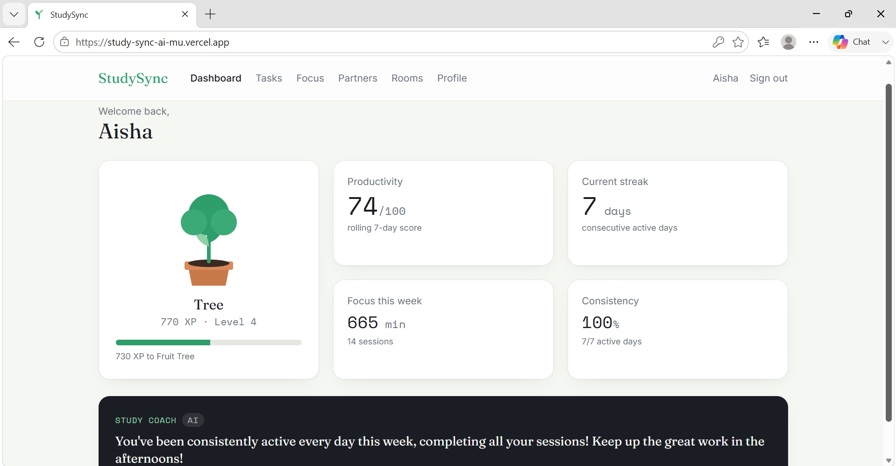

# StudySync AI

An AI-powered study accountability platform — match with study partners, plan
your work with an LLM, run focus sessions, and watch a garden grow as you build
consistent habits. A self-directed full-stack project built to production
patterns: a typed React frontend, a tested FastAPI backend, real-time presence,
and an LLM layer designed with explicit guardrails rather than raw prompt calls.

## Live demo

**App:** https://study-sync-ai-mu.vercel.app
**Demo login:** `demo@studysync.app` / `demopass123`

> The demo account is pre-populated with a week of activity (grown garden,
> streak, study plan, and a partner match), so it shows the product fully alive.
> First load may take ~30s while the free-tier server wakes from sleep.

<!-- Add screenshots here. Put images in docs/ and reference them:


-->

## Why this project is interesting

- **A grounded LLM layer, not a thin wrapper.** The AI features are designed so
  the model *enhances* deterministic logic instead of being trusted blindly —
  with guardrails against hallucination, structured outputs, and graceful
  fallbacks when the model is unavailable.
- **Full-stack and typed end to end** — React + TypeScript talking to a FastAPI
  backend, with the frontend types mirroring the backend schemas.
- **83 automated tests**, run hermetically with no network or real AI calls.
- **Real-time** study rooms with live presence over WebSockets (Socket.IO).
- **Real architecture decisions** worth discussing in an interview (below).

## The AI layer (design)

This is where most of the engineering thought went. Four AI features, each
built to fail safe and stay grounded:

- **Grounded personality engine.** Rather than asking the model to invent a
  learning personality (which invites hallucination), the backend first derives
  an *evidence-backed menu* of traits from the user's actual profile. The LLM
  may only *select and rephrase* from that menu; any trait it returns that
  isn't backed by real evidence is dropped. The model improves wording, but it
  can't make claims the data doesn't support.
- **Provider abstraction + deterministic fallbacks.** All AI calls go through a
  small `AIProvider` interface (OpenAI, Gemini, or a `NullProvider`). Every
  provider returns `None` on any error, and every feature has a deterministic
  fallback. If the API key is missing, rate-limited, or down, the app keeps
  working — it just degrades to rule-based output. The feature never 500s
  because of the model.
- **Structured outputs.** AI calls request strict JSON and parse defensively,
  so a malformed model response falls back rather than crashing.
- **AI study coach, grounded in computed facts.** The backend computes the
  user's real 7-day stats (best time of day, completed vs. missed sessions),
  and the model only *phrases* one insight from those facts — it never invents
  numbers.

The payoff: the AI makes the product feel smart, but uptime, cost, and
correctness never depend on the model behaving. That separation is the core
idea of the whole codebase.

## Architecture decisions

- **Deterministic vs. AI separation.** Partner matching, goal-tag extraction,
  and the personality trait menu are pure, testable functions that never depend
  on AI. The model is layered on top for explanation and phrasing only.
- **Transparent matching score.** Compatibility is a weighted sum the user can
  see broken down — schedule (30), subjects (25), learning style (20), goals
  (15), intensity (10) — with an *optional, lazy* AI explanation fetched only
  when requested.
- **Event-sourced read model.** Every meaningful action writes an `ActivityLog`
  event *in the same database transaction* as the domain write, so analytics
  can never drift out of sync with reality.
- **Idempotent, capped XP.** Garden progress is *derived* from the event log
  (with daily caps), not incremented on the fly — so it can't double-count and
  is always recomputable from source.
- **Scalable candidate pre-filter.** Matching uses a Postgres array-overlap
  (GIN-indexed) pre-filter before scoring, with a Python fallback for SQLite.
- **Timezone-correct streaks.** The user's timezone is captured at signup so
  "active days" bucket to *their* local day, not UTC.
- **Hermetic tests.** The suite forces SQLite + a null AI provider, so 83 tests
  run fast and deterministically with no external dependencies.

## Tech stack

**Backend:** FastAPI · PostgreSQL · SQLAlchemy · Alembic · JWT (python-jose) ·
bcrypt · Socket.IO (python-socketio) · Redis (optional, for multi-instance
presence) · pytest

**Frontend:** React 18 · TypeScript · Vite · Tailwind CSS · Framer Motion ·
React Router · socket.io-client

**AI:** OpenAI / Gemini, behind a provider abstraction with deterministic
fallbacks

**Deploy:** Render (backend) · Vercel (frontend) · Neon (Postgres)

## Features

- Email/password auth with JWT
- Study profile questionnaire → AI-generated learning personality
- AI study planner (goal + deadline → task breakdown) with rule-based fallback
- Task list with priorities and completion
- Focus timer (Pomodoro / deep work / stopwatch) with a live countdown and an
  anti-abuse cap so only genuine, completed sessions count
- Productivity score, weekly stats, and streaks from the activity log
- XP and a growing garden (Seed → Sprout → Flower → Tree → Fruit Tree)
- AI study coach insight grounded in your real stats
- Transparent partner matching with a per-component breakdown and lazy AI
  "why you match"
- Real-time study rooms with live presence (online / focusing / break)

## Project structure

```
studysync/
├── backend/        FastAPI app, SQLAlchemy models, services, Alembic migrations, tests
│   ├── app/
│   │   ├── api/        route handlers
│   │   ├── services/   business logic (matching, personality, gamification, AI providers…)
│   │   ├── models/     SQLAlchemy models + enums
│   │   └── realtime/   Socket.IO server
│   ├── tests/          83 hermetic tests
│   └── scripts/        demo seed script
└── frontend/       React + TypeScript + Vite app
    └── src/
        ├── pages/      Dashboard, Profile, Tasks, Focus, Matching, Rooms…
        ├── components/ Garden, PersonalityCard, MatchCard, Layout…
        └── lib/        typed API client + Socket.IO client
```

## Running locally

**Backend** (Python 3.12+, PostgreSQL or a Neon URL):

```bash
cd backend
python -m venv .venv && source .venv/bin/activate   # Windows: .venv\Scripts\activate
pip install -r requirements.txt
cp .env.example .env        # set DATABASE_URL, JWT_SECRET, AI_PROVIDER, OPENAI_API_KEY
alembic upgrade head
uvicorn app.main:socket_app --reload   # socket_app = HTTP + WebSockets
```

API docs at `http://localhost:8000/docs`.

**Frontend** (Node 18+):

```bash
cd frontend
npm install
cp .env.example .env         # set VITE_API_URL=http://localhost:8000
npm run dev                  # http://localhost:5173
```

**Seed a demo account** (optional, populates a rich dashboard):

```bash
cd backend
python -m scripts.seed_demo  # prints the demo login
```

## Testing

```bash
cd backend
pip install -r requirements-dev.txt
pytest        # 83 tests, no network / no real AI calls
```

## Limitations & next steps

Honest about where this is an MVP and what I'd build next:

- **Matching is rule-based.** The deterministic score is transparent and fast,
  but `goal_similarity` is tag-overlap. Next step: embed goal text and use
  cosine similarity for a semantic match (the design already isolates this).
- **No AI output evaluation harness.** I'd add golden-set tests and an
  automated check that fallbacks trigger correctly under provider failure.
- **Auth is intentionally minimal** — no refresh tokens, email verification, or
  password reset yet.
- **No rate limiting** on the AI endpoints; a per-user limit is the next guard.
- **No CI yet.** A GitHub Actions workflow running `pytest` on every push is the
  obvious next addition.
- **Free-tier cold starts** (~30s) on the backend and database.

## About

A self-directed project built end to end (backend, frontend, real-time, and
deployment) to practice production patterns around building products on top of
LLMs — grounding, guardrails, structured outputs, and graceful degradation.
